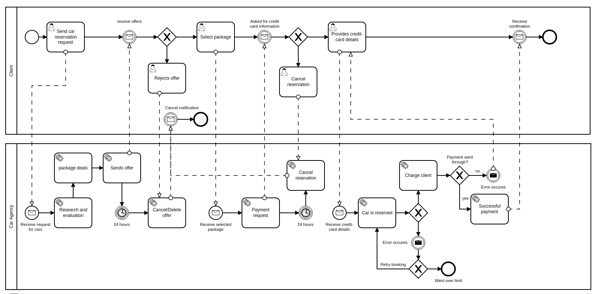

# Assignment-4
## Made by Tjalfe Møller & David Carl

1. Be able to name some products and some criteria for comparing them.

*some answer*

1. Instead of focusing on the differences between the products, get acquainted with the standard, which most of them share in following: BPMN 2.0.2

*some answer*

1. Download the poster from http://www.bpmb.de/images/BPMN2_0_Poster_EN.pdf and try to learn from it what a BPMN diagram is and what is its role. You will be able to experience it in the next sessions.

*some answer*

We choose to create a graphical model to [Booking C](https://github.com/datsoftlyngby/soft2019fall-si/blob/master/docs/Sessions/Week40/Assignments/Travel%20Booking%20C.pdf)

