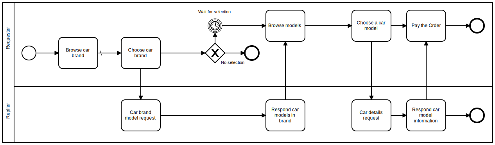

# EIP handin
## pattern name
[Request and Reply](https://www.enterpriseintegrationpatterns.com/patterns/messaging/RequestReplyJmsExample.html)
## visual representation (diagram)

## problem it can solve
It solves the problem that there can be multiple frontends that needs to serve the same backend. It ends up queuing whatever message there is until the next time the system is ready for input.

## what is it good for
This is good for handling connections between 2 (or more) applications it also supports that the recieving end is not running at the moment the request has been sent.

## one example of implementation
In the folder carInformation there is a test project. First you need to make sure that its the correct login information and IP to your RabbitMQ for it to run, then you need to run replier and then requester. Then just follow what it says in the console! :)

### Made By
David Carl

Tjalfe Møller

